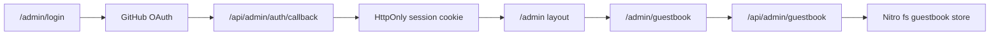

# Admin shell + guestbook manager

Auth: GitHub OAuth, allowlist = existing [`GITHUB_USERNAME`](nuxt.config.ts) (or `ADMIN_GITHUB_LOGIN` if you need a different login). No new npm packages: Node `crypto` HMAC session cookie + `fetch` to GitHub.

Public guestbook stay as they are: [`GET/POST /api/guestbook`](server/api/guestbook.get.ts). Drop `GUESTBOOK_ADMIN_TOKEN` Bearer routes in favor of session APIs.

## Auth (server)

Env (runtimeConfig, not `public`): `GITHUB_OAUTH_CLIENT_ID`, `GITHUB_OAUTH_CLIENT_SECRET`, `ADMIN_SESSION_SECRET`, optional `ADMIN_GITHUB_LOGIN` falling back to `github.username`. Callback `{siteUrl}/api/admin/auth/callback`.

- [`server/utils/admin-session.ts`](server/utils/admin-session.ts): sign/verify `{ login, exp }` (7d), `HttpOnly` `Secure` `SameSite=Lax` cookie; `requireAdmin(event)` used by all `/api/admin/*` except auth.
- `GET /api/admin/auth/github`: CSRF `state` cookie, redirect to GitHub `user:read`.
- `GET /api/admin/auth/callback`: exchange code, `GET https://api.github.com/user`, 403 if login mismatch, else set session and redirect `/admin`.
- `POST /api/admin/auth/logout`: clear cookie.
- `GET /api/admin/me`: `{ login }` for the shell.

Document creating a GitHub OAuth App (homepage = site URL, callback as above) in [`README.md`](README.md). Coolify: same `/app/.data` volume as today.

## Admin UI (thin shell)

Nuxt pages beside the existing one-pager ([`pages/index.vue`](pages/index.vue) stays the public site).

- [`layouts/admin.vue`](layouts/admin.vue): no dock/navbar, no pointer glow. Quiet sidebar from a registry.
- [`constants/admin-modules.ts`](constants/admin-modules.ts): `{ id, path, labelKey }[]` with **guestbook only**. Next feature = one more entry + one page + one `/api/admin/<id>` folder. No fake “coming soon” modules.
- [`pages/admin/login.vue`](pages/admin/login.vue): one “Continue with GitHub” control.
- [`pages/admin/index.vue`](pages/admin/index.vue): redirect to `/admin/guestbook`.
- [`pages/admin/guestbook.vue`](pages/admin/guestbook.vue): all entries (pending / approved / rejected), approve, reject, delete. English copy in locales is enough for admin (or `admin.*` in en/tr/ja if cheap).
- [`middleware/admin.ts`](middleware/admin.ts): if no session, `/admin/login`. Login page skips it.
- Hide Cursor/PointerGlow on `/admin` in [`app.vue`](app.vue). `robots: noindex` on admin routes.

Do not pair fill+outline buttons; status via type (weight/color), not pills.

## Guestbook backend

Extend [`server/utils/guestbook.ts`](server/utils/guestbook.ts) with `deleteEntry(id)` (and keep `moderateEntry`).

Replace [`server/api/guestbook/moderate.get.ts`](server/api/guestbook/moderate.get.ts) / [`moderate.post.ts`](server/api/guestbook/moderate.post.ts) with:

- `GET /api/admin/guestbook` — all entries (session)
- `PATCH /api/admin/guestbook/:id` — `{ action: "approve" | "reject" }`
- `DELETE /api/admin/guestbook/:id`

Remove `guestbook.adminToken` / `GUESTBOOK_ADMIN_TOKEN`.

## Out of scope

OAuth libraries, a second module, editing note text, public comments, exposing GitHub client secret to the browser.
