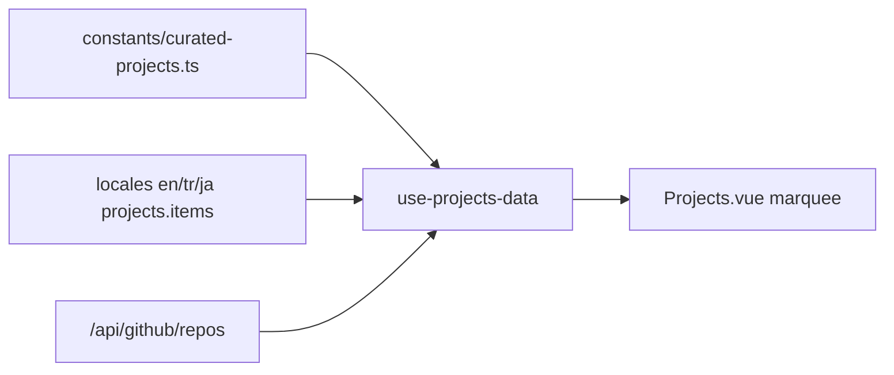

# Merge Glaze apps into Projects marquee

## Direction (locked)

Option 1: curated Glaze apps appear in **Projects** only. Sponsored catalog stays as-is (those three already exist there). No pin/filter of GitHub repos beyond merge + dedupe.

## Approach

Add a small curated constants list + locale copy, then prepend those projects when resolving the marquee data. Keep existing card UI unchanged (`visit` / optional `github`).



## Data

New [`constants/curated-projects.ts`](constants/curated-projects.ts):

| key | visit |
|-----|--------|
| `gitPersona` | `https://www.glaze.app/app/git-persona-l3UPlC` |
| `cura` | `https://www.glaze.app/app/cura-HP0tKT` |
| `dontBeAfk` | `https://www.glaze.app/app/dont-be-afk-2SXArO` |

No `github` field (visit-only cards). Keys match sponsored ids for consistency.

## i18n

Fill empty `projects.items` in [`locales/en.json`](locales/en.json), [`locales/tr.json`](locales/tr.json), [`locales/ja.json`](locales/ja.json):

```json
"items": {
  "gitPersona": { "name": "Git Persona", "description": "..." },
  "cura": { "name": "Cura", "description": "..." },
  "dontBeAfk": { "name": "Don't Be AFK", "description": "..." }
}
```

Reuse/adapt existing sponsored taglines as project descriptions (already present under `sponsoredByMe.apps.*`). `i18n/locales` is a symlink to `locales/` — edit root locales only.

## Merge logic

Update [`composables/use-projects-data.ts`](composables/use-projects-data.ts):

1. Build curated `Project[]` from constants + `t('projects.items.<key>.name|description')`
2. Take GitHub list from `/api/github/repos` as today
3. Dedupe: drop any GitHub repo whose `key` or lowercased `name` matches a curated key/name
4. Return `[...curated, ...github]` so Glaze apps lead the marquee

No changes to [`pages/projects/Projects.vue`](pages/projects/Projects.vue) or the GitHub API handler — cards already hide the GitHub icon when `github` is absent.

## Out of scope

- Sponsored section / logos
- Filtering or pinning other GitHub repos
- Project images or card redesign
