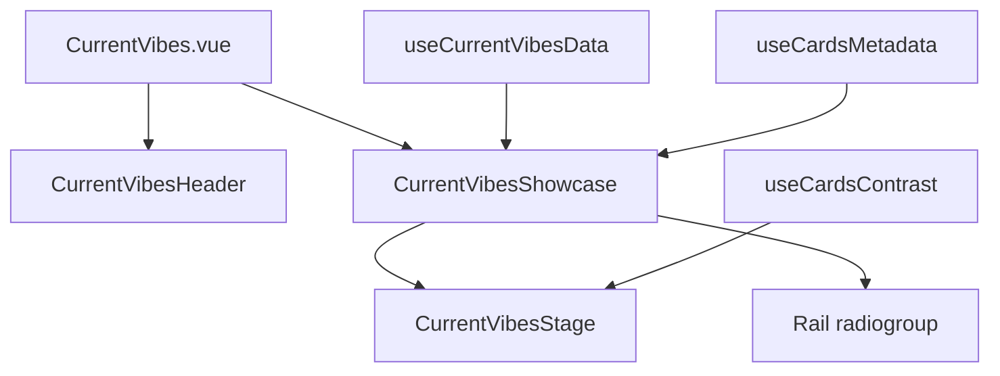

# Current Vibes stage + rail redesign

I have read the anti-slop design law and will re-check every point before calling this done.

## Direction (locked)

- **Layout:** Featured stage + selectable rail (same interaction model as [SponsoredShowcase.vue](components/sponsored-by-me/SponsoredShowcase.vue)), not a horizontal card carousel.
- **Sources kept:** game, trakt, music, blog, github, map (same order / presence rules as [current-vibes-data.ts](composables/current-vibes/current-vibes-data.ts)).
- **Atmosphere:** Full-bleed **cover / poster / album** behind the stage (real media). No section wash, no brand-orb language from Sponsored.
- **Motion:** Quiet stage/rail color transitions only; respect `reducedMotion`. No resting blur, no hover scale-lift. Content visible by default.
- **Density:** HLTB game card remains the chrome reference for stats, pills, and mobile compacting on every type.

## Architecture

**Keep:** data fetches, [cards-metadata.ts](composables/current-vibes/cards-metadata.ts), [cards-contrast.ts](composables/current-vibes/cards-contrast.ts), header, APIs, locale content keys.

**Drop from this section:** [AppleCardCarousel](components/ui/apple-card-carousel/), [carousel-drag.ts](composables/current-vibes/carousel-drag.ts), [carousel-navigation.ts](composables/current-vibes/carousel-navigation.ts), and the tall grab-to-swipe UX in [CurrentVibes.vue](pages/current-vibes/CurrentVibes.vue).

Leave the unused apple-card-carousel UI kit on disk (out of scope); only disconnect Current Vibes from it.

## UI composition

### Section shell ([CurrentVibes.vue](pages/current-vibes/CurrentVibes.vue))

- Keep flat `bg-white dark:bg-black`, centered header, `#current-vibes`.
- Replace carousel block with `<CurrentVibesShowcase :cards="cards" />`.
- Remove drag handlers, carousel refs, and related lifecycle.

### Showcase ([components/current-vibes/CurrentVibesShowcase.vue](components/current-vibes/CurrentVibesShowcase.vue) — new)

Mirror Sponsored patterns:

- `activeType` state (card `type` as id); default to first available card; watch list when APIs resolve.
- Featured stage renders active card via stage child.
- Rail: `role="radiogroup"`, arrow/Home/End keyboard nav, tonal active border (near-white light / dark neutrals), horizontal scroll on mobile, auto-fit grid on desktop.
- Rail thumb: small cover crop + category label (from metadata), not icon-in-tile boxes.
- `aria-live="polite"` on stage title/body when selection changes.

### Stage ([components/current-vibes/CurrentVibesStage.vue](components/current-vibes/CurrentVibesStage.vue) — new)

Replace [CurrentVibesCard.vue](components/current-vibes/CurrentVibesCard.vue) (~1.3k lines) by extracting type bodies into one stage shell:

- **Shell:** `rounded-3xl`, near-white / `neutral-950` floor, cover image **sharp and full-bleed** (no `blur-md` rest state). Soft top/bottom scrims driven by existing contrast (`isLight`) for legibility.
- **Chrome:** category + title + inverted Visit CTA (Sponsored-style `rounded-xl` fill), not a floating glass chip.
- **Body:** reuse game / trakt / music / blog / github / map detail markup from the old card, tightened:
  - Compact mobile pills (`hidden md:block` labels where already used).
  - Trakt and empty music get real density (type/date/subtitle; tops lists or clear empty copy) so they match HLTB weight.
  - Keep progress / monthly bars / stat rows; drop hover-scale and blur-unblur machinery.
- Prefer `NuxtImg` / plain `img` for cover (or keep `AppleBlurImage` only if still useful without blur); do not gate visibility on animation.

### Settings / i18n

- Update `settings.disableCardHoverEffects*` copy in en/tr/ja (and `i18n/locales` twins) — blur/scale no longer apply. Either retarget the setting to any remaining stage transitions, or remove the toggle wiring if nothing remains to disable (prefer remove dead setting if stage only uses `reducedMotion`).
- Add any new rail aria strings under `currentVibes.*` if Sponsored-style labels are needed; keep existing card copy keys.

## Anti-slop / craft constraints (ship gate)

- Flat section floor; mood only on the cover stage.
- No purple/cream/candy atmospheres; no glass kitchen-sink; no hover-lift; no opacity-0 entrance.
- Bare marks in rail (cover thumb), not icons in colored tiles.
- Text clear of edges and scrims; dark secondary labels stay readable (`neutral-300`+).
- Light surfaces stay near-white (`neutral-50` / white), not kit gray.
- After implementation: walk anti-slop points and fix anything that still matches carousel/glass/hover-lift tells.

## Out of scope

- Changing API contracts or fetch sources.
- Deleting the unused apple-card-carousel package.
- Redesigning other portfolio sections.
