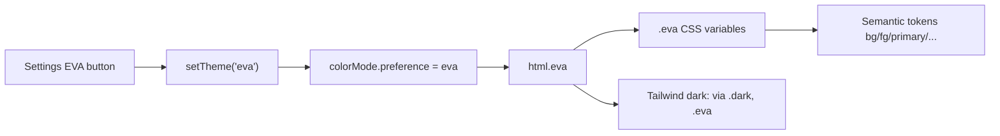

# Add EVA (Unit-01) theme

## Approach

Treat **EVA** as a fourth absolute theme preference (`"light" | "dark" | "system" | "eva"`), not nested under system. It is a **dark-leaning** palette so existing `dark:` utilities and Three.js dark paths keep working.

Unit-01 color direction (HSL channels, same format as existing tokens):

- **Base:** near-black with a faint purple cast (not cool blue-charcoal)
- **Ink:** pale lavender / off-white
- **Primary / surfaces:** Unit-01 purple (`~270–285°`)
- **Accent / ring:** neon lime-green (`~90–110°`) for eyes/accents
- **Borders / muted:** deep purple-gray

## Palette (CSS)

Add a `.eva` block next to `.dark` in [`assets/css/tailwind.css`](assets/css/tailwind.css), redefining the same variables (`--background`, `--foreground`, `--primary`, `--accent`, `--muted`, `--border`, `--ring`, etc.).

Concrete target feel:

| Token | Role |
|-------|------|
| `--background` | purple-black void |
| `--foreground` | pale lavender |
| `--primary` | Unit-01 purple |
| `--primary-foreground` | neon green or pale ink |
| `--accent` / `--ring` | neon green |
| `--muted` / `--secondary` | deep purple panels |
| `--border` / `--input` | purple-tinted edge |

Keep contrast readable (muted text clearly above the purple-black base). No purple-to-indigo SaaS glow; purple + green is intentional Unit-01 branding.

## Color mode + Tailwind

1. **[`nuxt.config.ts`](nuxt.config.ts)** — keep `classSuffix: ""` so preference `"eva"` applies class `eva` on `<html>` (same pattern as `dark`).
2. **[`tailwind.config.ts`](tailwind.config.ts)**:
   - `darkMode: ["selector", ".dark, .eva"]` so `dark:` utilities apply under EVA
   - `safelist: ["dark", "eva"]`
   - Update the custom `light:` variant from `html:not(.dark)` to `html:not(.dark):not(.eva)` so sponsored light overrides do not fire on EVA

## Settings wiring

Centralize the union as something like `ThemePreference = "light" | "dark" | "system" | "eva"` and thread it through:

- [`composables/settings.ts`](composables/settings.ts) — widen `setTheme`
- [`composables/navbar/use-navbar-settings.ts`](composables/navbar/use-navbar-settings.ts) — accept `"eva"` in validators/watchers; add `setEvaTheme`
- [`components/navbar/Navbar.vue`](components/navbar/Navbar.vue), [`NavbarSettingsDrawer.vue`](components/navbar/NavbarSettingsDrawer.vue), [`NavbarSettingsPanel.vue`](components/navbar/NavbarSettingsPanel.vue) — pass handler + option

**Settings control:** fourth theme button labeled **EVA** (short text mark `"01"` inside the button instead of a Lucide icon), matching the existing compact icon-button row.

## Locales

Update live locale files under [`locales/`](locales/) (and mirror in [`i18n/locales/`](i18n/locales/) to avoid drift):

- `settings.eva`: `"EVA"` / `"EVA"` / `"エヴァ"`
- `settings.themeDescription`: mention EVA (en/tr/ja)

## Dark-aware JS scenes

Shared helper (tiny, colocated in settings or a one-liner composable): treat resolved mode as dark when `colorMode.value === "dark" || colorMode.value === "eva"`.

Update existing binary checks so EVA does not fall into the light Three.js palette:

- [`MusicTurntable.vue`](components/current-vibes/scenes/MusicTurntable.vue)
- [`WatchingScreen.vue`](components/current-vibes/scenes/WatchingScreen.vue)
- [`CodingCommitField.vue`](components/current-vibes/scenes/CodingCommitField.vue)
- [`TravelGlobe.vue`](components/current-vibes/TravelGlobe.vue)
- [`ScrollIsland.vue`](components/ui/scroll-island/ScrollIsland.vue)

Scenes stay on the dark path under EVA (no separate Three.js EVA palette in this pass) so the CSS theme is the signature.

## Out of scope

- No EVA-specific fonts, grain overlays, or entry animations
- No change to default theme (`system` remains default / reset target)
- No new dependencies
