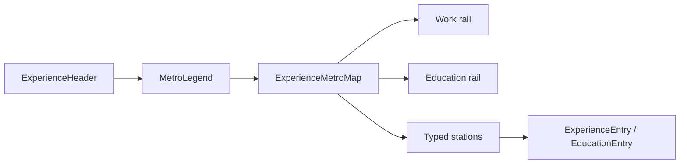

# Dual-route Experience Metro Map

## Direction

Merge Work and Education into one newest-first chronology. Drop tabs. Restyle as a **dual-route transit map**: Work and Education run as two parallel rails; each stop sits on its own line; scroll draws route progress. Content stays fully visible by default (no opacity-gated entrances).

## Visual system

- **Layout**: Vertical map in `#experience`. Desktop keeps sticky org/school label; mobile keeps the label inside the entry (existing pattern).
- **Rails**: Two parallel 2px tracks down the spine (Work slightly left, Education slightly right). Idle track is muted tonal ink; active fill is the line color.
- **Stations**: Solid disc on the matching rail + short connector into the entry. Work vs Education distinguished by color and a tiny typographic line mark (`W` / `E` or locale short label), not pill chips.
- **Colors** (CSS variables on the section, light/dark aware): Work = near-ink charcoal; Education = restrained warm slate (not purple, not candy). Self-colored edges only.
- **Motion** (reuse `motion-v` scroll pattern from current `[Timeline.vue](components/ui/timeline/Timeline.vue)`):
  1. Scroll-linked height fill on both rails (same progress, content never hidden).
  2. Station disc “arrives” (fill/weight shift) when progress reaches it.
  3. Respect `prefers-reduced-motion`: static full rails, no fill animation.

## Data / logic

Update `[composables/experience/timeline-data.ts](composables/experience/timeline-data.ts)`:

- Add `useMergedTimelineItems()` that concatenates work + education, sorts by existing `getStartDate` (newest first).
- Keep `useTimelineItemsForComponent` / `useTimelineItemsWithSlots` (or fold into one helper) so slots stay keyed by type + org + index.
- Remove tab-keyed `useTimelineItems(activeTabKey)`.

Simplify `[pages/experience/Experience.vue](pages/experience/Experience.vue)`: drop tab state/watchers/`ExperienceTabs`; render header + legend + metro map over merged items.

Locale-only data stays canonical (`experience.workExperiences` / `experience.educations`). Reuse `experience.workExperience` / `experience.education` for legend labels in en/tr/ja. Optionally tighten `experience.description` to reflect one journey map.

## Components

| Action  | File                                                                                                                                                                          |
| ------- | ----------------------------------------------------------------------------------------------------------------------------------------------------------------------------- |
| Rewrite | `[pages/experience/Experience.vue](pages/experience/Experience.vue)`                                                                                                          |
| Add     | `components/experience/ExperienceMetroMap.vue` — dual rails, scroll fill, station geometry, slots                                                                             |
| Add     | `components/experience/MetroLegend.vue` — two bare line swatches + labels                                                                                                     |
| Tweak   | `[ExperienceEntry.vue](components/experience/ExperienceEntry.vue)` / `[EducationEntry.vue](components/experience/EducationEntry.vue)` — spacing for connector; no card chrome |
| Delete  | `[ExperienceTabs.vue](components/experience/ExperienceTabs.vue)` (only consumer of tab UI here)                                                                               |
| Delete  | `[components/ui/timeline/Timeline.vue](components/ui/timeline/Timeline.vue)` + barrel (Experience is the sole consumer)                                                       |
| Clean   | `[types/experience.ts](types/experience.ts)` — remove unused `ExperienceTab`; `[components/experience/index.ts](components/experience/index.ts)` / composable barrel          |

Keep entry copy as-is (title, period/duration, description). Do not surface unused `technologies` / `achievements` unless asked.

## Out of scope

- No changes to navbar section id, SEO observer, or `constants/experience.ts` (still unused by UI).
- No new dependencies; stick to existing `motion-v` + Tailwind.

