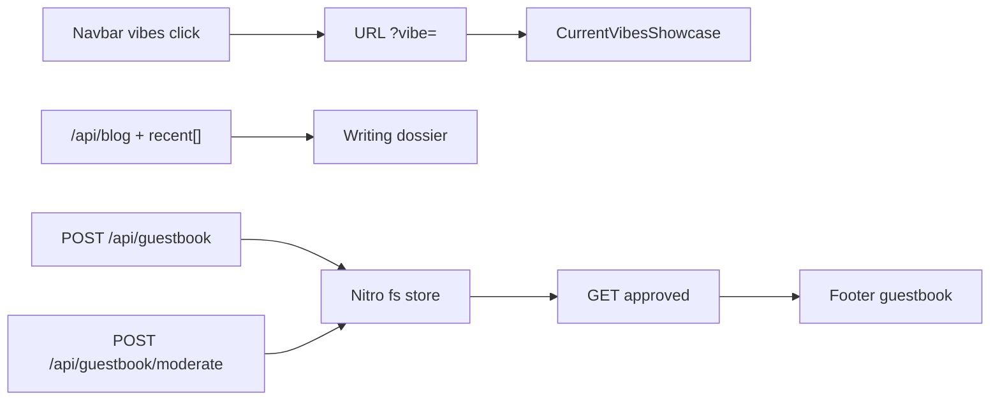

# Portfolio levers + guestbook

Confirmed: **not looking / building**; contact stays LinkedIn. **Signed guestbook** (pending moderation), not comments or a counter.

Copy lives only in `[locales/en.json](locales/en.json)`, `[locales/tr.json](locales/tr.json)`, `[locales/ja.json](locales/ja.json)` (`langDir` is `./locales` in `[nuxt.config.ts](nuxt.config.ts)`). Do not edit the stray `i18n/locales/` tree. No new npm packages.

## 1. Project case studies (same stage)

Keep the featured stage + rail in `[components/sponsored-by-me/SponsoredShowcase.vue](components/sponsored-by-me/SponsoredShowcase.vue)`. Under the existing tagline, add three short lines from locales: `projects.apps.<id>.problem`, `.stack`, `.outcome`. Optional keys; hide a line if missing. Do not add pills, chips, extra CTAs, or a new section.

Draft EN/TR/JA from current taglines (Farkle, BaklaVue, Nest Concept, Don't Be AFK, Git Persona, Cura, Read My Screen, Crossing of the Rhine, Spaceflash). Keep each line one sentence.

## 2. Hire beat + availability (not looking)

- Add locale strings: building / not looking, plus “LinkedIn if you need me.”
- Under Resume on Welcome (`[pages/welcome/Welcome.vue](pages/welcome/Welcome.vue)` / `[DownloadCvButton.vue](components/DownloadCvButton.vue)`): one quiet text link using `appConfig.socialLinks.linkedin`. Not a second button pair (no fill+outline duo).
- Same status string in the navbar Current Vibes tooltip (under the live preview in `[NavbarDesktop.vue](components/navbar/NavbarDesktop.vue)` / mobile). Type treatment only; no pulsing “live” dot for availability.

## 3. Writing list

Extend `[server/api/blog.ts](server/api/blog.ts)` and `[types/current-vibes.ts](types/current-vibes.ts)` so the handler still returns the latest post plus `recent: { title, link, published_at, readTime }[]` (first 5 feed items). Thread through `[cards-metadata.ts](composables/current-vibes/cards-metadata.ts)` and list those posts in the Writing block of `[CurrentVibesStage.vue](components/current-vibes/CurrentVibesStage.vue)` (plain title + date links, not cards).

## 4. About

Rewrite `[aboutMe.description](locales/en.json)` (and TR/JA) into 2–3 short sentences: engineer in Turkey, ships Vue/Nuxt products, currently building rather than looking. Keep `[AboutMe.vue](pages/about-me/AboutMe.vue)` + `TextScrollReveal`; no new layout. Align `[seo/sections.ts](seo/sections.ts)` About blurb with the same facts.

## 5. Vibe deep links

Query param `vibe` with values matching `[CardData["type"]](composables/current-vibes/current-vibes-data.ts)`: `game` | `music` | `blog` | `map` | `trakt` | `github` | `reading`.

- `[CurrentVibesShowcase.vue](components/current-vibes/CurrentVibesShowcase.vue)`: on load, if `vibe` matches a loaded card, `selectType`; on tab change, `router.replace` the query (keep hash/`#current-vibes`).
- Navbar Current Vibes action: scroll as today and set `vibe` from preview kind (`music`/`game`/`reading`/`trakt`) via `[useNavbarVibesPreview](composables/navbar/use-navbar-vibes-preview.ts)`.

## 6. Guestbook (footer, before Farewell)

Nitro file storage (no DB). Document a Coolify persistent volume for the data dir so restarts do not wipe notes.

- `[server/utils/guestbook.ts](server/utils/guestbook.ts)`: sanitize (strip tags, trim), max name 40 / note 120, honeypot, in-memory IP rate limit (1 POST / 15 min).
- `GET /api/guestbook`: approved entries only (newest first, cap ~40).
- `POST /api/guestbook`: create **pending**; response copy “held for review.” Never echo raw HTML.
- `POST /api/guestbook/moderate`: `Authorization: Bearer` + `GUESTBOOK_ADMIN_TOKEN`; body `{ id, action: "approve" | "reject" }`. No public admin UI.

UI in `[pages/footer/Footer.vue](pages/footer/Footer.vue)` above Farewell: short heading, signed list (`name`, `note`, date), compact name+note fields + submit. Empty state one line. No comment threads, avatars, or visitor count.

Verification: `node --test` on sanitize/rate-limit helpers (Node 19+, no Vitest).

## Out of scope

Visitor counter, threaded comments, new CMS, extra project grids, `i18n/locales` sync, Three.js LCP work.

## Check after implement

- Light + dark: About, Projects dossier, hire line, guestbook, Writing list; secondary text contrast via `dark:` classes.
- Content visible without animation; guestbook form usable on mobile.
- Missing LinkedIn env: hide the hire link.
- Missing `GUESTBOOK_ADMIN_TOKEN`: POST moderate returns 503; public GET still works if store exists.

