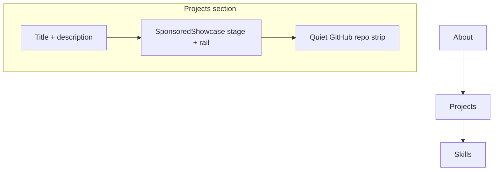

# Merge Sponsored into Projects

## Direction (locked)

- **UI:** Sponsored showcase wins (featured stage + app rail).
- **GitHub:** quieter strip under the showcase (not a second marquee).
- **Name:** section + nav = **Projects** (`#projects`).
- **Placement:** keep Sponsored’s slot after About; drop the later Projects slot.

New page order in `[pages/index.vue](pages/index.vue)`:

Welcome → About → **Projects** → Skills → Experience → Current Vibes → Footer

## Section shell

Rewrite `[pages/projects/Projects.vue](pages/projects/Projects.vue)` as the merged section:

- `id="projects"`, observer label `"Projects"` (SEO already has a Projects entry in `[seo/sections.ts](seo/sections.ts)`).
- Centered H2/description from `projects.*` (reuse Sponsored’s shipped-products voice, not the old generic marquee blurb).
- Mount existing `[SponsoredShowcase.vue](components/sponsored-by-me/SponsoredShowcase.vue)` with `[sponsoredApps](constants/sponsored-apps.ts)` (keep catalog/types/component paths; rename is user-facing only).
- Mount a new quiet repo strip below.

Delete `[pages/sponsored-by-me/](pages/sponsored-by-me/)` and its import from `index.vue`.

## Quiet GitHub strip

New small component (e.g. `components/projects/ProjectsRepoStrip.vue`):

- Horizontal, muted list of repo name + optional visit / GitHub link.
- No cards, no speed control, no marquee, no bordered stage twin of the showcase.
- Hide entirely when pending fails empty or list is empty (no loud error chrome).

Slim `[composables/use-projects-data.ts](composables/use-projects-data.ts)`:

- GitHub `/api/github/repos` only.
- Dedupe against sponsored catalog ids/names (same normalize helper as today).
- Drop curated Glaze prepend (those three already live in the showcase).

Delete `[constants/curated-projects.ts](constants/curated-projects.ts)`.

## Nav / SEO / settings cleanup

- `[use-navbar-navigation.ts](composables/navbar/use-navbar-navigation.ts)`: remove Sponsored item; keep one Projects item → `#projects` (AppWindow or FolderGit2 — use AppWindow to match shipped-apps focus).
- `[navbar.types.ts](components/navbar/navbar.types.ts)`: drop `"sponsored-by-me"` from `NavbarSection`.
- `[seo/sections.ts](seo/sections.ts)`: remove `"Sponsored (by me)"`; tighten Projects description to shipped-apps + open-source strip.
- Remove `marqueeSpeed` from `[composables/settings.ts](composables/settings.ts)` and related locale keys (`settings.marqueeSpeed`, projects speed labels). Leave `[components/ui/marquee](components/ui/marquee)` in place if unused (no forced delete).

## i18n (edit root `locales/` only; `i18n/locales` is a symlink)

In en/tr/ja:

- Fold user-facing Sponsored copy into `projects`: `title` = Projects, `description` from current `sponsoredByMe.description`, keep Visit/Open/empty/cardAriaLabel under `projects`.
- Move `sponsoredByMe.apps.*` → `projects.apps.*` and update `[SponsoredShowcase.vue](components/sponsored-by-me/SponsoredShowcase.vue)` key paths.
- Add a short strip label (e.g. `projects.openSource`) for the GitHub row.
- Remove `nav.sponsoredByMe`, old `sponsoredByMe` tree, Glaze `projects.items.*`, and marquee speed strings.

## Out of scope

- Redesigning the showcase itself.
- Renaming `sponsored-apps.ts` / `SponsoredApp` / component folder (internal names stay).
- Filtering or pinning specific GitHub repos beyond sponsored-name dedupe.

