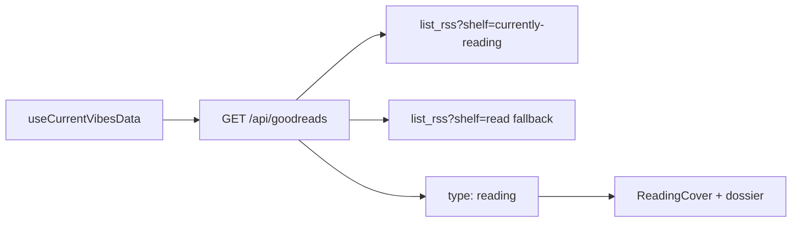

# Reading vibe via Goodreads RSS

## Direction (locked)

- **Data:** currently-reading shelf first; if empty, most recent item on the `read` shelf (Trakt-style “now or last”).
- **Scene:** Three.js book with live cover texture (same image-proxy pattern as `[GamingCover.vue](components/current-vibes/scenes/GamingCover.vue)` / `[MusicTurntable.vue](components/current-vibes/scenes/MusicTurntable.vue)`).
- **Source:** Goodreads public RSS only (API is dead). No new npm dependency — hand-parse shelf XML on the server.




## Server: `/api/goodreads`

New file `[server/api/goodreads.ts](server/api/goodreads.ts)`:

- Env: `GOODREADS_USER_ID` via `runtimeConfig.goodreads.userId` in `[nuxt.config.ts](nuxt.config.ts)`. Visit URL stays `appConfig.socialLinks.goodreads` (`GOODREADS_PROFILE_URL`, already wired).
- Fetch `https://www.goodreads.com/review/list_rss/{userId}?shelf=currently-reading` then, if no items, `?shelf=read`.
- Parse first `<item>` for Goodreads fields: `title`, `author_name`, `book_image_url` / `book_large_image_url`, `link`, `user_date_added` / `user_read_at`, `book_id`.
- Response shape (add to `[types/current-vibes.ts](types/current-vibes.ts)`):

```ts
interface GoodreadsBook {
  title: string;
  author: string;
  image: string;
  link: string;
  status: "reading" | "finished";
  date?: string; // added / read_at ISO-ish from feed
  bookId?: string;
}
```

- Missing user id or empty both shelves → `null` (card omitted, same as Trakt). Errors → `{ status, message }` or `null` so the section still works.

Allow Goodreads CDNs in `[server/api/image-proxy.get.ts](server/api/image-proxy.get.ts)`: `i.gr-assets.com`, `images.gr-assets.com` (and `*.gr-assets.com` hostnames used by covers).

## Wire into Current Vibes

1. Extend `CardData.type` with `"reading"` in `[composables/current-vibes/current-vibes-data.ts](composables/current-vibes/current-vibes-data.ts)`; `useFetch("/api/goodreads")`; push card after `trakt` when data exists.
2. `case "reading"` in `[composables/current-vibes/cards-metadata.ts](composables/current-vibes/cards-metadata.ts)`: title, author, cover `src`, category (`currentlyReading` / `recentlyFinished`), `visitUrl` → Goodreads profile (or book `link` if preferred — default profile to match other vibes).
3. Locales in `[locales/en.json](locales/en.json)`, `[locales/tr.json](locales/tr.json)`, `[locales/ja.json](locales/ja.json)`:
  - `currentVibes.tabs.reading`: Reading / Okuma / 読書
  - `currentVibes.cards.reading.*`: defaultTitle, currentlyReading, recentlyFinished, author, Visit labels as needed
4. Navbar (`[composables/navbar/use-navbar-vibes-preview.ts](composables/navbar/use-navbar-vibes-preview.ts)`): if `status === "reading"`, insert after HLTB playing and before Trakt (cover thumbnail). Finished-only books stay out of the preview to avoid noise.

## UI: scene + dossier

- New `[components/current-vibes/scenes/ReadingCover.vue](components/current-vibes/scenes/ReadingCover.vue)`: hardcover mesh (front cover = proxied texture, spine + page block, slight idle drift / drag yaw). Reuse GamingCover’s lifecycle patterns (renderer dispose, reduced-motion, image-proxy URL). Distinct proportions from the Switch cart so Reading ≠ Gaming.
- Export from `[components/current-vibes/index.ts](components/current-vibes/index.ts)`.
- `[CurrentVibesStage.vue](components/current-vibes/CurrentVibesStage.vue)`: scene branch + compact dossier (title, author, status label, optional date, Visit) — monochrome ink/white pills, no brand accents, matching Watching/Gaming dossier density (no yearly stats in this pass).

## Config / ops

- Document `GOODREADS_USER_ID` next to existing Goodreads profile env (numeric ID from profile URL, e.g. `goodreads.com/user/show/12345-…`).
- No footer provider churn required (RSS is first-party Goodreads, no RSS2JSON).

## Out of scope

- Yearly reading stats / multi-book shelves
- OAuth or scraping HTML
- New XML parser packages

