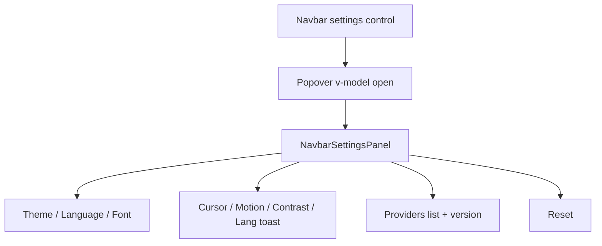

# Merge Settings + Providers into Navbar Popover

I've read the anti-slop design law and will re-check against it before calling this done. Promise held at ship time: point-by-point pass on the new panel (no pill/Beta chrome, no purple glow, no card lift, content visible by default, real contrast, no jammed edges).

## Direction (locked)

- **One entry point:** navbar Settings (desktop dock + mobile menu). Footer Providers link removed; Version stays alone.
- **One surface:** existing shadcn Popover (`[components/ui/popover/](components/ui/popover/)`), not Dialog.
- **Density:** compact single scroll — keep all functional settings, drop secondary chrome (Beta badge, keyboard-shortcuts block, long helper descriptions under switches). Providers land as a quiet **Sources** list at the bottom (with Goodreads added to match Current Vibes).

## Architecture

**Split current dialog into:**

1. `**[NavbarSettingsPanel.vue](components/navbar/NavbarSettingsPanel.vue)**` — pure content (controls + Sources). Same props/callbacks as today’s dialog body.
2. `**[NavbarSettingsPopover.vue](components/navbar/NavbarSettingsPopover.vue)**` — `Popover` + `PopoverTrigger` (slot) + scrollable `PopoverContent` wrapping the panel.

**Wire triggers where the button already lives** (needed because Popover must anchor):

- `[NavbarDesktop.vue](components/navbar/NavbarDesktop.vue)`: special-case `id === 'settings'` — wrap `DockIcon` in the popover trigger instead of bare `@click="action"`.
- `[NavbarMobile.vue](components/navbar/NavbarMobile.vue)`: same for the settings row; open popover instead of only firing `navItemClick` (avoid closing the whole sheet before the popover mounts — open controlled `open` from parent, or keep menu open while popover is open).

**Parent:** `[Navbar.vue](components/navbar/Navbar.vue)` keeps `useNavbarSettings()` state; rename `settingsDialogOpen` → `settingsPopoverOpen` in `[use-navbar-settings.ts](composables/navbar/use-navbar-settings.ts)`. Pass open + handlers into Desktop/Mobile (or render one shared popover with a trigger slot per breakpoint — prefer embedding popover at each trigger site with shared `v-model:open` so only one panel instance isn’t required; two instances are fine if both share the same open ref carefully — **better: one popover in Desktop XOR Mobile** since only one navbar renders).

Delete `[NavbarSettingsDialog.vue](components/navbar/NavbarSettingsDialog.vue)`; update `[components/navbar/index.ts](components/navbar/index.ts)`.

## Panel UI (redesign)

- Width ~`min(22rem, 100vw - 2rem)`, `max-h` ~70vh, `overflow-y-auto`, tight `p-3` / `gap-3` (mobile-first, matches AGENTS compact preference).
- Quiet title row: `settings.title` only — no modal close button (popover dismisses on outside click / Esc).
- **Segmented rows** for theme / language / font size / font family (reuse outline `Button` group pattern, icon-only theme marks OK).
- **Switch rows** via existing `[SettingsRow.vue](components/navbar/SettingsRow.vue)` but **label-only** (descriptions → `sr-only` or dropped; shorter labels if needed).
- Divider, then **Sources:** map providers from a small constant or computed (HLTB, Spotify, Goodreads, RSS2JSON, Trakt, GitHub) using existing `footer.providers.`* keys + new Goodreads keys in en/tr/ja.
- Footer of panel: version line + reset control (text/outline, full width, no glow).

Avoid: Beta pill, Lucide-in-colored-tiles, purple accents, card hover-lift, opacity-0 entrance gating.

## Footer cleanup

- `[Footer.vue](pages/footer/Footer.vue)`: remove Providers import/usage and the middle `·` separator so meta row is just `Version`.
- Delete `[pages/footer/Providers.vue](pages/footer/Providers.vue)` (logic moves into the panel).

## i18n

- Keep `footer.providers.*` keys (panel reuses them) or move under `settings.providers` — **reuse `footer.providers`** to minimize churn; add `goodreads.name` / `goodreads.description` in en/tr/ja.
- Optional short `settings.sources` heading string in all three locales.

## Out of scope

- No change to `composables/settings.ts` persistence or HTML class plugin.
- Marquee speed stays on Projects.
- No new dependencies.

