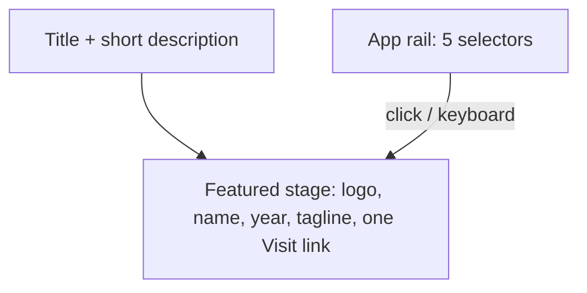

# Sponsored section: editorial rethink

I've read and understood the anti-slop design law; the implementation will follow it, and before calling this done I'll re-check every relevant point (no purple/cyan atmosphere blobs, no fullscreen chrome, content visible by default, no fill+outline CTA pair, no card-hover-lift defaults, brand atmosphere only from each app's own `brandColor`).

## Direction (locked)

- **Layout:** large featured product stage + compact app rail (option 1A)
- **Delete:** OGL infinite grid, fullscreen, related cursor state, and `ogl` dependency
- **Fit the site:** match Welcome / About / Skills monochrome rhythm (huge tracking-tight H2, light subcopy, white/black surfaces); per-app color only inside the featured stage via existing `brandColor`

## Composition

Rewrite `[pages/sponsored-by-me/SponsoredByMe.vue](pages/sponsored-by-me/SponsoredByMe.vue)`:

- Drop indigo/violet/cyan radial blobs and the grid/fullscreen hint line
- Keep section id, observer, empty state
- Mount a new showcase component instead of `SponsoredAppsInfiniteGrid`

New primary UI in `components/sponsored-by-me/` (replace both current sponsored UI files):

- **Featured stage:** full-width (max ~6xl) brand-tinted surface for the active app — logo (reuse contain/wide slot logic from `[ExpandableAppGallery.vue](components/sponsored-by-me/ExpandableAppGallery.vue)`), name, year, tagline, single Visit/Open action (`visitExternal` / `visitInternal`)
- **Rail:** five selectors under the stage (name + year + small mark). Active state = tonal weight/color shift, not a underline-fill or dot
- **Default selection:** first entry in `[constants/sponsored-apps.ts](constants/sponsored-apps.ts)` (`farkle`)
- **Motion:** crossfade / soft brand-atmosphere swap on selection; if `reducedMotion`, swap instantly with no opacity-gated content
- **A11y:** rail as `tablist`/`tab` or radiogroup pattern; featured region updates with `aria-live="polite"` for name; links keep external `rel`/`target` behavior already used in the gallery

Do **not** reuse `AppleCardCarousel` (Current Vibes already owns that pattern). Do **not** keep the hover-expand strip as the default experience.

## Deletions

| Remove                                                                                                                  | Why                                                                |
| ----------------------------------------------------------------------------------------------------------------------- | ------------------------------------------------------------------ |
| `[components/sponsored-by-me/SponsoredAppsInfiniteGrid.vue](components/sponsored-by-me/SponsoredAppsInfiniteGrid.vue)`  | Fullscreen + grid shell                                            |
| `[components/sponsored-by-me/ExpandableAppGallery.vue](components/sponsored-by-me/ExpandableAppGallery.vue)`            | Superseded by showcase (lift brand helpers into the new component) |
| `[components/ui/infinite-grid/](components/ui/infinite-grid/)` (entire folder)                                          | Only consumer of OGL grid                                          |
| `ogl` from `package.json`                                                                                               | Only used by infinite-grid                                         |
| Fullscreen state in `[components/Cursor.vue](components/Cursor.vue)` (`sponsored-infinite-grid-fullscreen` + condition) | Dead after grid removal                                            |

## Data / i18n

- `[types/sponsored-app.ts](types/sponsored-app.ts)`: rename `grid: { date }` → `year: string` (grid is gone); update constants accordingly
- Locales `en` / `tr` / `ja`: remove `enterFullscreen`, `exitFullscreen`, `hintGrid`; drop or rewrite `hintReducedMotion` into a short non-grid hint if still useful; keep `title`, `description`, `empty`, visit strings, `cardAriaLabel`, app name/tagline; remove unused `gridDescription` keys (featured uses `tagline`)

## Out of scope

- No new dependencies
- No changes to navbar scroll target (`sponsored-by-me`)
- No redesign of other homepage sections

