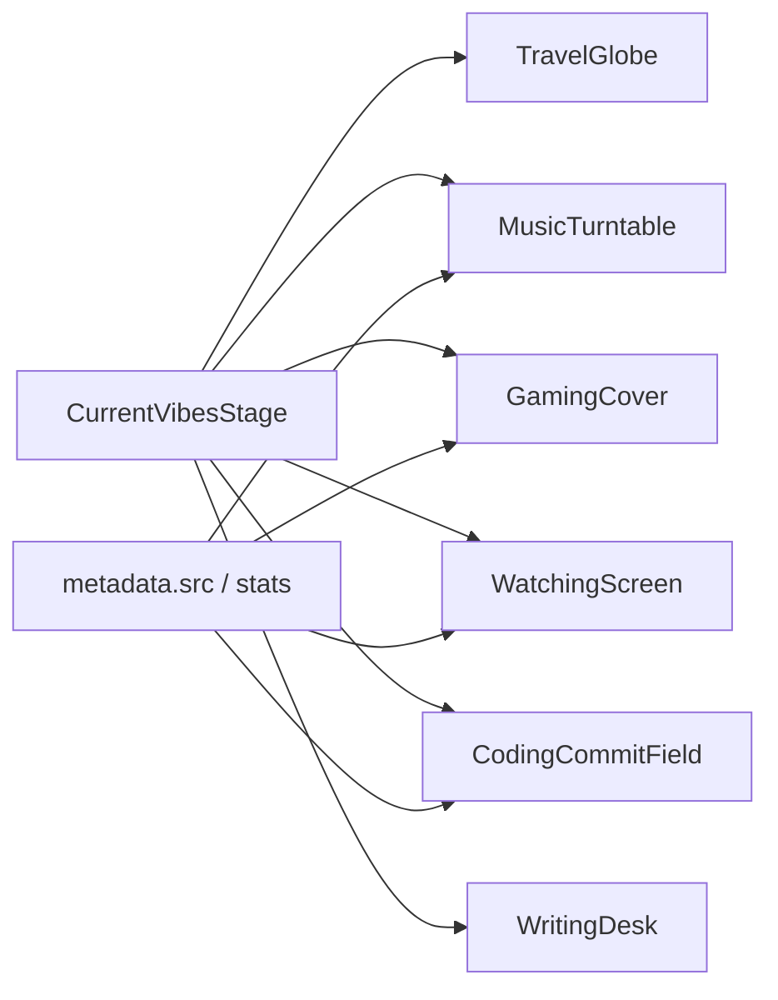

# Interactive Current Vibes category scenes

## Direction (locked)

- **Hybrid:** richer animated stages for Gaming / Watching / Music; lighter CSS/Canvas for Coding / Writing.
- **API covers as hero artifacts** (not full-bleed background only): album on turntable, game cover as floating box-art, poster as screen content.
- **Travel stays** as [`TravelGlobe.vue`](components/current-vibes/TravelGlobe.vue).
- **No new deps** (reuse `vue-use-spring`, CSS 3D, Canvas 2D; keep parity with COBE’s weight).

## Architecture

Swap the cover `` branch in [`CurrentVibesStage.vue`](components/current-vibes/CurrentVibesStage.vue) for a type switch, same pattern as Travel:

```vue
<ClientOnly v-if="card.type === 'map'"><TravelGlobe /></ClientOnly>
<ClientOnly v-else-if="card.type === 'music'"><MusicTurntable :src="metadata.src" :is-playing="metadata.isPlaying" /></ClientOnly>
<!-- game / trakt / github / blog similarly -->
```

Ink panel (stats, pills, copy) stays unchanged. Only the left cover plane becomes a scene.



New components under `components/current-vibes/scenes/` (one file per category), re-exported from [`components/current-vibes/index.ts`](components/current-vibes/index.ts).

Shared interaction conventions (mirror TravelGlobe):

- Pointer drag / tilt via `vue-use-spring`
- Idle motion only when `!reducedMotion`
- Light/dark via tonal neutrals (no purple glow, no brand hue splash)
- `ResizeObserver` + cleanup on unmount
- Cover image always readable without waiting for animation (anti invisible-content)
- Fallback: if `src` fails or is empty, keep a quiet tonal stage without breaking layout

## Scene specs

### Music — turntable + pickup (`MusicTurntable.vue`)

- Platter + tonearm as the category means; **Spotify album art** as the vinyl center label (and optional sleeve leaning behind).
- Spin when `metadata.isPlaying`; slower idle spin when not playing; stop under reduced motion.
- Drag tilts the deck slightly (perspective); tonearm sits on the groove when playing.
- Soft ambient wash from album color is optional and secondary — hero is the art on the disc.

### Gaming — floating box-art (`GamingCover.vue`)

- **HLTB `game.image`** as a perspective CSS “cartridge / cover” with thickness edge (pseudo 3D box).
- Pointer parallax orbit; subtle idle float when not reduced motion.
- Category detail: faint controller silhouette or scanline field behind, low contrast, never covering the cover art.
- Progress ring or edge accent can hint completion if `progressPercentage` is available (tonal ink only).

### Watching — screen + poster (`WatchingScreen.vue`)

- CRT / cinema bezel as the means; **Trakt/TMDB image** fills the glass as the hero.
- Soft screen flicker / scanlines (gated by reduced motion); slight perspective tilt on drag.
- Bezel chrome stays tonal; no fake macOS window chrome.

### Coding — commit / contribution field (`CodingCommitField.vue`)

- No API cover; build a **canvas or CSS contribution lattice** driven by `metadata.contributionsByMonth` (and totals if useful).
- Interactive: pointer warps / highlights cells; idle pulse of “commit lines” traveling the field.
- Reads as git activity, not a stock photo of code.

### Writing — desk / type field (`WritingDesk.vue`)

- No API cover; authored scene: stacked manuscript lines / typewriter carriage / ink strokes that react to pointer.
- Optional tiny title snippet from `metadata.title` as set type on the page — still secondary to the desk metaphor.
- Keep sparse and editorial; no stock blog wallpaper.

## Stage / layout tweaks

In [`CurrentVibesStage.vue`](components/current-vibes/CurrentVibesStage.vue):

- Apply Travel-like taller cover mins to all interactive scenes (or at least music/game/trakt) so the artifacts have room.
- Remove the static `` path for non-map types once scenes mount.
- Keep `ClientOnly` so SSR does not flash broken canvas; show a neutral tonal placeholder as fallback slot content.

## Constraints (from repo prefs + anti-slop)

- Stay visually distinct from Sponsored (no bordered stage + app-rail twin already; scenes are media-first).
- No Lucide-in-colored-tiles as the hero; scenes are the hero.
- No purple gradients / glowy pills / content gated at opacity 0.
- Honor `useSettings().reducedMotion`.
- Prefer Bun tooling if any scripts are needed; no new packages without approval.

## Out of scope

- Changing ink-panel stats layouts or tab labels
- Travel globe behavior
- Navbar vibes preview
- Fetching new API fields (use existing `metadata.src` + github monthly series)