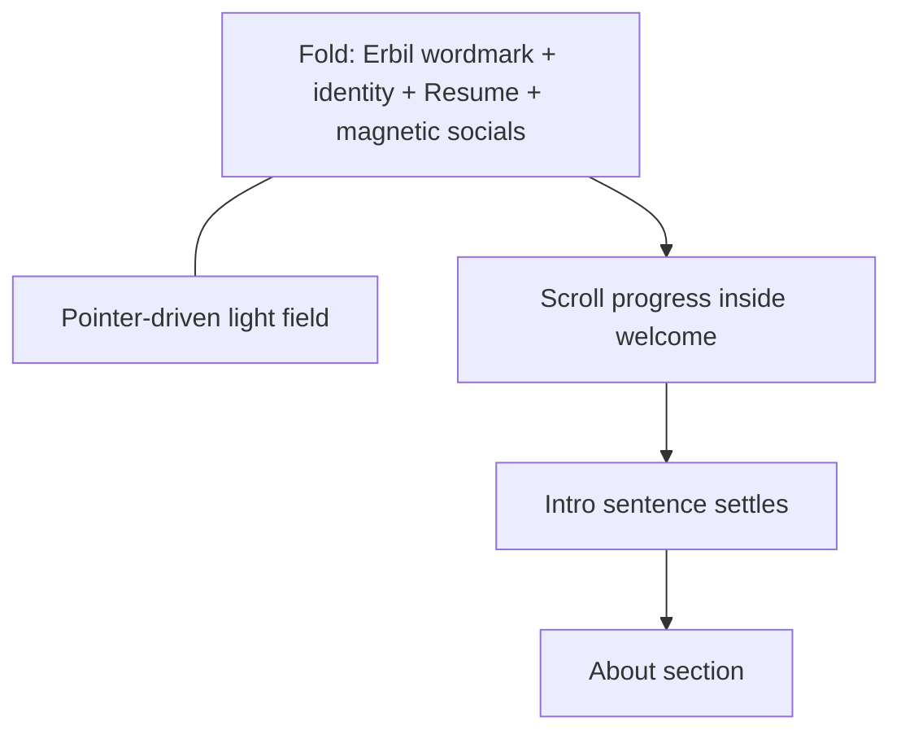

# Welcome Signal Field redesign

I have read the anti-slop design law end to end. Before shipping, I will walk it point-by-point and fix anything that fails.

## Chosen signature (2 + 3 + 4)

**Signal Field** — one composition, not a dashboard:

1. **Fold:** Oversized **Erbil** wordmark owns the viewport. One quiet identity line. One Resume action. Socials as a magnetic strip that reacts to the pointer. Atmosphere is a soft, directional light that follows the cursor (CSS vars), not a flat black void and not a purple/cream gradient blob.
2. **Scroll beat:** `#welcome` grows taller (~160vh). As you scroll, the wordmark settles slightly and a short localized intro lands beneath, bridging into About. No bounce “Scroll to see more” copy.
3. **Surprise craft:** Pointer proximity magnetizes social icons; Resume CTA gets a restrained hover (tonal shift / slight icon slide), not the shimmer-glow pill. FlipWords blur theater leaves the fold.

## What stays / what goes

| Keep | Cut / replace |
|------|----------------|
| `#welcome`, `useObserver`, nav scroll target | Centered Hello + TextGenerateEffect stack |
| Preview-first Resume (`/resume`) | White intro pill + TextHighlight |
| All 10 social links + tooltips | FlipWords on the fold |
| en/tr/ja localization | ScrollReminder instructional bounce |
| `reducedMotion` / mobile-safe behavior | ShimmerButton glow as the welcome CTA |

## UX structure

**Beat A — fold (always readable, even with JS/motion off)**
- Brand: `welcome.name` at display scale (`clamp` / large responsive type), tracking tightened, not a multi-line Hello stack.
- One identity line: cycle through existing `welcome.flippingWords` with a simple crossfade (or static first phrase when `reducedMotion`), muted secondary contrast that stays readable in dark mode.
- Resume: same preview flow via `DownloadCvButton`, but a quieter Welcome-specific visual (outline/tonal, no shimmer). Prefer a small `variant` prop on [`DownloadCvButton.vue`](components/DownloadCvButton.vue) rather than a second CV component.
- Socials: reuse link data from [`SocialLinks.vue`](pages/welcome/SocialLinks.vue); restyle into a horizontal magnetic rail (desktop). Mobile: compact wrap, no magnetics.

**Beat B — scroll narrative**
- Section height ~`160vh`; sticky/pinned fold content with scroll-linked transforms (scale/translate of wordmark, opacity of intro beat only as enhancement—**content of beat B remains in the DOM and visible without animation**; motion only shifts emphasis, never gates existence).
- New locale string e.g. `welcome.scrollLead` (en/tr/ja): one short sentence that hands off to About (do not duplicate the full About bio).

**Pointer field**
- New composable e.g. [`composables/welcome/use-welcome-pointer.ts`](composables/welcome/use-welcome-pointer.ts): tracks normalized `x/y` inside the section, writes `--welcome-x` / `--welcome-y`, optional magnet offsets for nearby social icons.
- Active only when: client, fine pointer, desktop-ish width, and not `reducedMotion`. If custom cursor is disabled, field still works (it is section light, not the cursor chrome).
- Atmosphere: radial light from pointer using existing surface tones (near-white / deep charcoal), optional very low grain behind content. No purple, no cream editorial wash, no centered halo ring behind the name.

## File plan (fewest files)

Rewrite / extend:
- [`pages/welcome/Welcome.vue`](pages/welcome/Welcome.vue) — two-beat layout, pointer CSS vars, sticky fold + scroll lead
- [`pages/welcome/SocialLinks.vue`](pages/welcome/SocialLinks.vue) — magnetic rail API (or absorb into a thin `WelcomeSocialRail.vue` if magnetics make SocialLinks messy; prefer edit-in-place)
- [`components/DownloadCvButton.vue`](components/DownloadCvButton.vue) — optional `variant: "shimmer" | "quiet"` (default shimmer for resume page if still used elsewhere; Welcome uses quiet)
- Locales [`locales/en.json`](locales/en.json), [`locales/tr.json`](locales/tr.json), [`locales/ja.json`](locales/ja.json) — add `welcome.scrollLead`; keep `name` / `flippingWords`; drop unused keys only if nothing else references them (`hello` / `introduction` can remain unused briefly or be removed if grepped clean)

Add:
- `composables/welcome/use-welcome-pointer.ts`
- Thin presentational pieces only if Welcome.vue gets heavy: `WelcomeWordmark.vue`, `WelcomeAtmosphere.vue` (atmosphere = absolute decorative layer, `pointer-events-none`, grain behind text)

Remove usage of:
- [`pages/welcome/ScrollReminder.vue`](pages/welcome/ScrollReminder.vue) (delete if unused)
- Fold use of `TextGenerateEffect`, `TextHighlight`, `FlipWords`, `IntroductionText` (delete `IntroductionText.vue` if unused)

Do **not** change About content, navbar dock, or Sponsored/Vibes patterns.

## Motion rules (hard)

- Content visible by default (anti invisible-content trap).
- Gate spotlight, magnets, wordmark parallax, and identity cycling behind `useSettings().reducedMotion`.
- Prefer CSS/`requestAnimationFrame` + CSS vars over new deps; GSAP already exists via Cursor—only reuse if it clearly simplifies, otherwise stay CSS/composable-local.
- No hover-lift on the Resume button; no underline-fill; no floating bobbing cards.
- Respect AGENTS: cut hint copy; light theme stays near-white; dark secondary text contrast.

## Acceptance checklist

- Fold reads as one composition: brand, one line, one CTA, social rail.
- Pointer moves light on desktop; mobile still looks intentional without dead empty space.
- Scroll through Welcome shows intro lead before About without blank frames if motion is off.
- Resume still goes to `/resume` preview, then download.
- Social links all work; tooltips/labels preserved.
- `reducedMotion` flattens to a static, fully readable hero.
- Anti-slop re-check: no shimmer glow CTA, no pill intro, no purple/cream/grid backdrop, no instructional scroll chip, no content gated on opacity 0.