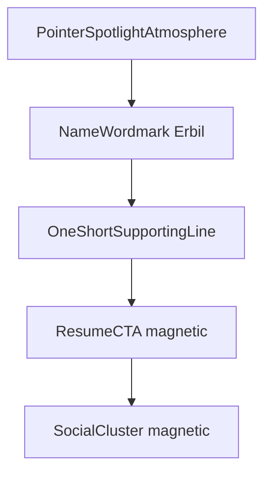

# Welcome Interactive Spotlight Redesign

I've read the anti-slop design law in full. Implementation will end with a point-by-point re-check (content visible by default, no glowy pills, no purple aurora, no instructional scroll chrome, brand owns the fold).

## Direction (locked)

**Interactive spotlight** — completely different first-fold experience from today’s typography stack.

Keep: `#welcome`, SEO observer, preview-first Resume (`/resume`), all social links, en/tr/ja.

Cut: giant “Hello” + `TextGenerateEffect`, white `TextHighlight` pill, FlipWords as the main beat, `ShimmerButton` glow CTA, bounce “Scroll to see more”.

## Target UX

One composition in the first viewport:

- **Desktop:** soft radial light tracks the pointer over the section (`--spot-x` / `--spot-y`). Name and line sit in the clear center. Social icons and Resume subtly magnet-pull toward the pointer (GSAP already in the project via [`components/Cursor.vue`](components/Cursor.vue)).
- **Mobile / touch:** static centered vignette; no magnetic; compact social row.
- **Reduced motion / cursor disabled:** spotlight frozen at center; no magnet transforms; content fully visible with no entrance opacity gate.

Copy hierarchy:

1. **Erbil** — hero-level wordmark (`welcome.name`), not a nav-sized label.
2. One short line — static `welcome.tagline` (new key; migrate the best current FlipWords sense, e.g. “vibe coding like a pro” / localized equivalents). No rotating FlipWords on the fold.
3. Quiet intro optional under tagline only if it still reads as one sentence (`welcome.introduction` without the highlight pill). Prefer cutting it if the name + tagline already carry the beat.
4. Resume CTA → still `navigateTo('/resume')`.
5. Socials stay 10 links from `appConfig.socialLinks`.

## Visual rules (anti-slop + AGENTS)

- Atmosphere = **tonal ink spotlight** on the existing page surface (light: near-white; dark: current charcoal). No purple/blue-purple blobs, no candy aurora, no cream “editorial” wash.
- No cards in the hero. Socials = bare Phosphor marks (no icon tiles).
- Resume CTA: tonal fill/border shift on hover — **not** `ShimmerButton`, not fill+outline pair, no hover-lift “boop”.
- Grain only behind content if used; never over type.
- Match site type (SF Pro / system stack already in [`tailwind.config.ts`](tailwind.config.ts)); no new Google display face.

## Implementation

### 1. Spotlight composable

Add [`composables/welcome/use-welcome-spotlight.ts`](composables/welcome/use-welcome-spotlight.ts):

- Pointermove on the Welcome section → CSS vars on the root.
- `matchMedia('(pointer: fine)')` + `md+` for interaction.
- Read `useSettings().reducedMotion` / `cursorDisabled` to freeze spotlight and skip magnets.
- rAF-throttle updates; clean up listeners on unmount.

### 2. Rewrite Welcome shell

Rewrite [`pages/welcome/Welcome.vue`](pages/welcome/Welcome.vue):

- Keep `section#welcome` + `useObserver("Welcome", sectionRef)`.
- Full-viewport relative stage with spotlight layer (`pointer-events-none`) using the CSS vars.
- Centered column: name → tagline → Resume → socials. Tighter rhythm than `gap-16` / `py-32` emptiness.
- Wire spotlight composable; pass magnet enable flag into children.

### 3. Slim intro + drop FlipWords / scroll hint

- Rewrite [`pages/welcome/IntroductionText.vue`](pages/welcome/IntroductionText.vue): plain type, no `TextHighlight` pill (or delete and inline the tagline in Welcome).
- Stop mounting `FlipWords`, `TextGenerateEffect`, `ScrollReminder`.
- Delete [`pages/welcome/ScrollReminder.vue`](pages/welcome/ScrollReminder.vue) if unused after.

### 4. Playful socials

Rewrite [`pages/welcome/SocialLinks.vue`](pages/welcome/SocialLinks.vue):

- Keep tooltip + external links.
- Desktop: light magnetic translate toward pointer (section-local, small strength — don’t fight the global custom cursor).
- Hover: tonal color shift only (no scale-up boop, no glow tile).
- Mobile: existing compact `grid-cols-5` pattern, denser gap.

### 5. Resume CTA without shimmer

Update [`components/DownloadCvButton.vue`](components/DownloadCvButton.vue) with a quiet `variant` (e.g. `spotlight`) used only on Welcome: solid/tonal button, icon + `common.showResume`, still preview-first. Leave resume-page download button unchanged.

### 6. Locales

Add `welcome.tagline` in [`locales/en.json`](locales/en.json), [`locales/tr.json`](locales/tr.json), [`locales/ja.json`](locales/ja.json). Keep `welcome.name` / `welcome.introduction` / `welcome.hello` (hello can remain unused for now or for SEO meta only). Leave `flippingWords` in JSON unused by the fold (safe; no forced deletion of tr/ja arrays).

## Out of scope

- Navbar dock, About section, global `Cursor.vue` rewrite, new dependencies.

## Done criteria

- First viewport reads as one interactive composition with **Erbil** as the brand signal.
- Pointer moves the light; socials/Resume feel responsive on desktop; mobile stays calm and usable.
- Reduced motion: no magnet, static light, everything readable without animation.
- Resume still preview-then-download; all socials still open correctly.
- Final anti-slop pass fixes any residual glow pills, entrance-hidden content, purple atmosphere, or clipped text.